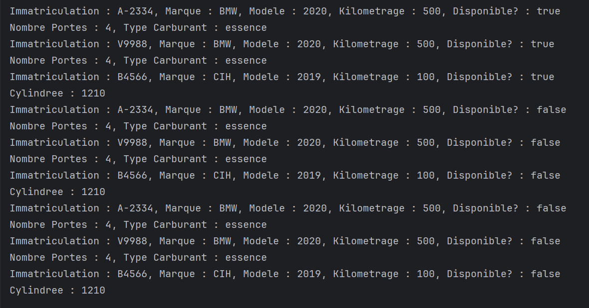

# 🚗 Parc Automobile – Gestion de Location de Véhicules (Kotlin)

## 📘 Description
Ce projet est une **application de gestion de parc automobile** développée en **Kotlin**.  
Elle permet de gérer les **véhicules**, les **conducteurs** et les **réservations** avec un système simple basé sur la **programmation orientée objet (POO)** et la **gestion d’exceptions**.

---

## 🧱 Structure du Projet

### 1. Classe `Vehicule` (abstraite)
Représente la base pour tous les véhicules du parc.  
**Attributs :**
- `immatriculation`
- `marque`
- `modele`
- `kilometrage`
- `disponible`

**Méthodes principales :**
- `afficherDetails()` → Affiche les informations du véhicule.  
- `estDisponible()` → Vérifie la disponibilité.  
- `marquerIndisponible()` / `marquerDisponible()` → Met à jour la disponibilité.  
- `mettreAJourKilometrage(km: Int)` → Met à jour le kilométrage.

---

### 2. Classe `Voiture` (hérite de `Vehicule`)
Ajoute :
- `nombrePortes`
- `typeCarburant`

**Méthode :**
- Redéfinition de `afficherDetails()` pour afficher les infos spécifiques.

---

### 3. Classe `Moto` (hérite de `Vehicule`)
Ajoute :
- `cylindree`

**Méthode :**
- Redéfinition de `afficherDetails()`.

---

### 4. Classe `Conducteur`
Représente un conducteur.

**Attributs :**
- `nom`
- `prenom`
- `numeroPermis`

**Méthode :**
- `afficherDetails()` → Affiche les informations du conducteur.

---

### 5. Classe `Reservation`
Lie un **véhicule** à un **conducteur** avec une période donnée.

**Attributs :**
- `vehicule`
- `conducteur`
- `dateDebut`
- `dateFin`
- `kilometrageDebut`
- `kilometrageFin` (optionnel)

**Méthodes :**
- `cloturerReservation(kilometrageRetour: Int)` → Met à jour le kilométrage et rend le véhicule disponible.  
- `afficherDetails()` → Affiche les détails de la réservation.

---

### 6. Classe `ParcAutomobile`
Gère la liste des **véhicules** et des **réservations**.

**Attributs :**
- `vehicules : MutableList<Vehicule>`
- `reservations : MutableList<Reservation>`

**Fonctionnalités :**
- `ajouterVehicule()` → Ajoute un véhicule au parc.  
- `supprimerVehicule()` → Supprime un véhicule par immatriculation.  
- `reserverVehicule()` → Crée une réservation et marque le véhicule comme indisponible.  
- `afficherVehiculesDisponibles()` → Liste les véhicules disponibles.  
- `afficherReservations()` → Liste les réservations en cours.

---

### 7. Gestion des Exceptions
Deux exceptions personnalisées :
- `VehiculeIndisponibleException`
- `VehiculeNonTrouveException`

Elles sont utilisées lors des tentatives de réservation de véhicules inexistants ou déjà réservés.

---

## ⚙️ Exécution du Programme

### 🧩 Étapes principales dans `main()` :
1. Création de quelques véhicules (voitures et motos).  
2. Ajout de ces véhicules dans le parc.  
3. Création de conducteurs.  
4. Réservation de véhicules avec gestion d’exceptions.  
5. Affichage des véhicules disponibles et réservés.  
6. Clôture d’une réservation (mise à jour du kilométrage).  
7. Suppression d’un véhicule du parc.

---

## 📸 Screenshots
